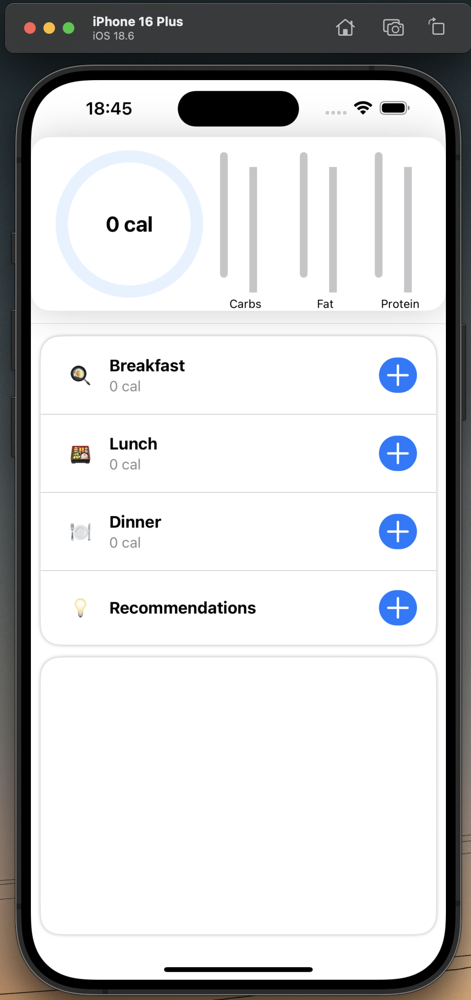
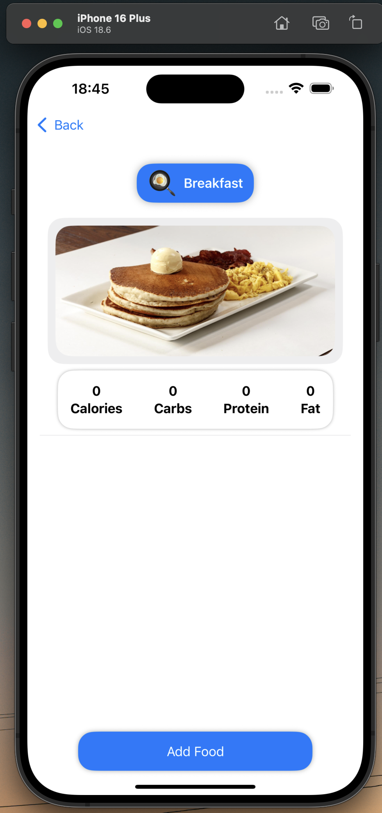
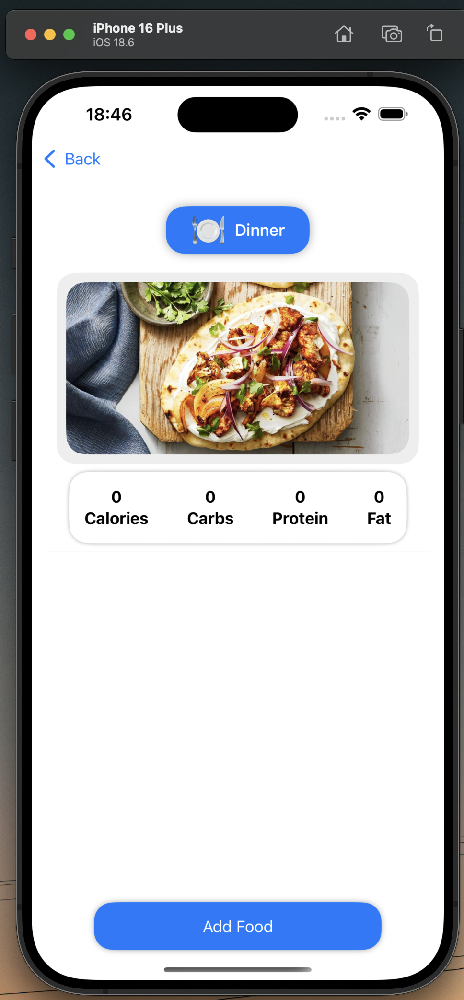

# 🍽️ HeelFuel

A modern iOS app for nutritional awareness—track your meals, view real-time dining hall data, and get personalized meal recommendations.

---

## 📚 Description

**HeelFuel** makes it easy for students to make informed dining choices on campus. With real-time data from UNC’s dining halls and restaurants, you can:

- **Track Your Nutrition:**  
  Log your daily intake of calories, carbs, fat, and protein.
- **Detailed Food Insights:**  
  Browse ingredients, view allergens, and see complete nutrient breakdowns for every food item.
- **Personalized Meal Recommendations:**  
  Get suggestions tailored to your dietary preferences and restrictions.
- **Meal Section Breakdown:**  
  See calories and macros for each meal section throughout your day.
- **Water Tracker:**  
  Stay hydrated with a built-in water tracking tool.

All your data is securely managed with Firebase and a custom RESTful API.

---

## 🖼️ Screenshots

  
  
  

---

> Built for Tar Heels who want to fuel up smarter—anytime, anywhere.
